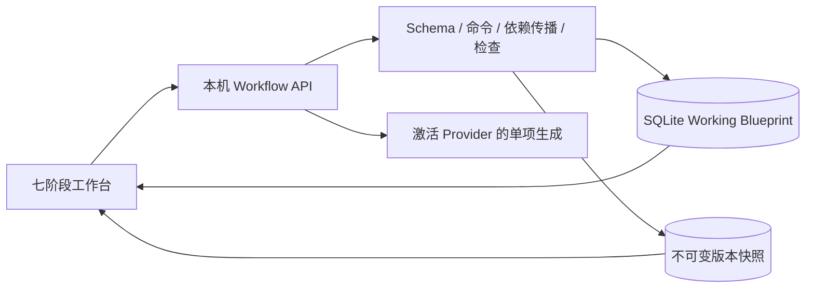

# 前置创作 Workflow 与 Game Blueprint

## 1. 背景与范围

在现有本地单人创作基底上实现游戏开始前的七阶段工作流：基础设定、人物、结局、卷与章节、章节人物变化与关键分支、SLG 系统与初始世界、总体检查。产出可编辑、可审批、可 JSON 交换和版本化保存的 Game Blueprint。

本次范围不包含正式 Runtime、Character Agent、时间 Tick、动态 Scene、正文对白、玩家存档或实际游戏流程。

## 2. 仓库认知与证据

| 模块 | 已确认职责与证据 |
| --- | --- |
| 前端 | `src/client/App.tsx` 为页面与导航入口；`ProviderSettings.tsx` 管理模型配置；`NarrativePreview.tsx` 为示例图。沿用 `styles.css` 的深色 Token 和按钮，不重构既有页面。 |
| 本机 API | `src/server/index.ts` 注册 Hono、回环监听和 Host / Origin / Fetch Metadata 防护；Vite 代理 `/api`，生产同进程托管静态页面。 |
| 数据库 | `src/server/db/index.ts` 使用 better-sqlite3 / WAL，逐项事务执行 `migrations.ts` 中的启动迁移；Drizzle schema 与实际 DDL 同步维护。现有三张业务表没有 Blueprint。 |
| Provider | `providerProfiles.ts` 提供激活配置，`secretVault.ts` 只在服务端解密；`openAICompatible.ts` 已有模型目录和 SDK 工厂，默认 8 秒超时不适合创作。`chatgptOAuth.ts` 已有授权与 Token 刷新。 |
| 共享契约 | `src/shared` 已用于前后端 DTO，可追加 Workflow 的 Zod Schema、字段定义和纯领域逻辑。 |
| 构建与测试 | `npm run build` 构建前端和后端；前端严格类型检查需另外运行 `tsc --noEmit`。原项目没有测试套件，本次使用 Node 内置测试运行器及现有 tsx，不新增测试依赖。 |

现有 README 的 SIWC 未实现说明与代码不一致，应在交付阶段更新。真实 Provider 资格、额度及模型创作质量不由本机模拟验证证明。

## 3. 需求与验收契约

- 固定结构从已知数据构建大纲；人物、结局、每章关键分支、系统清单先规划、再审核，确认之前不创建详情、不自动批量生成。
- 每次只生成一个审批单元；拒绝、修订、保持原内容并重新审批均有明确状态。
- 所有必需单元 APPROVED 才能确认阶段，下一阶段需前置阶段已确认。
- 任何已批准前置内容变化都保留后续数据，通过依赖图传播 NEEDS_REVIEW；总体检查同步失效。
- JSON 输入需类型、必填、版本、引用和未知字段检查；展示摘要后再次确认才替换工作数据。
- Working Blueprint、阶段、选择对象、清单、审批和复审状态落盘；模型任务状态先持久化，失败或重启可恢复。
- Finalize 需全部阶段通过、检查报告最新且没有 ERROR；Create Version 可保存创作中的快照。版本不可变，可查看、比较、复制为 Working Version。

## 4. 设计取舍与影响范围

采用共享领域契约 + 服务端命令边界 + SQLite 工作文档与版本表。复杂创作内容以受 Schema 校验的 JSON 保存，阶段转换不相信浏览器提交的状态。相较把全部对象拆成独立表，此方案适合现有本地单用户规模，避免引入无关 ORM 重构；后续若跨项目检索成为需求，再按查询模式拆表。

并发写入使用工作文档 revision 乐观锁，避免两个标签页互相覆盖；AI 请求不持有 SQLite 事务，回写须校验生成标识与输入版本。每项目只允许一个活跃生成单元，UI 轮询真实状态，不虚构百分比。参数化 SQL、输入体积限制及既有本机安全中间件覆盖新增路由。

对结构化生成，复用激活 Provider 与服务端凭据路径；兼容中转走 Chat Completions，计划授权走 Responses。模型输出再经 Schema 和引用校验，不能写入审批状态或悄悄扩张已确认清单。

## 5. 分阶段实现与提交

1. 领域：Stage FIXED / AI_PLANNED、Outline Plan、Approval、实体字段、依赖图、检查规则与契约测试。
2. 服务端：追加迁移、工作文档与快照保存、导入预览/确认、导出、AI 单项生成与错误恢复、API 集成测试。
3. 前端：导航增量接入，七阶段与三栏编辑，清单审批、基础输入、生成审批、复审、导入导出和版本面板，自动/手动保存。
4. 验证：全流程与异常场景、数据库重开恢复、浏览器交互、构建、类型检查和安全复核，更新 README 与本文。

每个阶段完成编码与相应验证后，按历史 `feat: 中文说明` / `fix: 中文说明` 格式本地提交，不自动推送。

## 6. 验证计划与风险

- 领域测试：未经批准清单不得生成，逐项审批顺序，固定结构展开，前置修改复审传播，未处理 ERROR 阻止 Finalize，非法/未来版本 JSON 拒绝。
- SQLite / API 集成：临时数据库、冲突 revision、不可变快照、导入失败保留原数据、重开恢复、生成失败恢复、陈旧 AI 输出丢弃。
- Provider 模拟：本机模拟 JSON 输出验证真实 HTTP 请求与 Schema 边界，禁止使用真实数据库覆盖测试。
- 浏览器：基础设定输入与保存、刷新恢复、清单编辑与确认、实体审批、版本查看和导入预览；真实服务商模型和叙事质量另行验证。

风险为中：新增一条核心创作数据流。主要防护为追加迁移、事务、乐观锁、明确审批门禁、导入二次确认及不可变快照。未知 Schema Version 先拒绝，预留版本迁移入口，不猜测转换规则。

## 7. 实施进展与实际结果

### 阶段一：领域与审批规则

已新增 `src/shared/workflow.ts` 与 `workflowEngine.ts`：Zod Schema、完整字段、七阶段状态派生、清单审批后建实体、单项生成顺序、固定卷章与每章分支作用域、依赖传播、总体检查与 Finalize 门禁。命令返回新副本，避免修改调用者输入。AI 输出只允许当前单元的内容，不能提交 ID、批准状态或跨阶段内容。

阶段一实际验证：`node --import tsx --test tests/workflow-schema.test.ts tests/workflow-engine.test.ts` 共 16 项通过，`npm run build:api` 通过，领域差异检查通过。涵盖清单门禁、用户预设保留、逐项审批、结构展开、复审传播、ERROR / 陈旧报告阻塞、取消与陈旧 token、未知字段和引用约束。

明确的保护边界：缩减已经创作的卷章结构会被拒绝，避免删除下游内容；删除已创作清单项目会保留为禁用项目。依赖图目前包含本次模型实际使用的前置阶段内容，因此复审传播较保守，可能比手工指定的关联范围更广。真实 Provider 请求与浏览器尚未在阶段一验收。

### 阶段二：持久化、生成与版本 API

追加启动迁移 `0003_workflow_blueprints`，同步 Drizzle schema；新增 `workflow_working`、`workflow_versions`，保留现有 Provider 和向量表。Working 文档用 revision CAS 保存；快照使用事务 INSERT，并以数据库触发器禁止 UPDATE / DELETE。版本链可从历史版本分叉，导入外部 Blueprint 时不伪造本地父版本。

`/api/workflow` 提供读写命令、202 后台单项生成、取消、导入预览/确认、JSON 导出及版本创建/查看/复制。所有新入口复用本机请求防护，限制请求大小并禁止缓存。模型提示词包含当前目标、批准上下文及 JSON Schema；调用不持有数据库事务，取消后迟到结果不回写。重启恢复中断状态，保留原内容并要求显式重试，避免自动重复收费请求。

AI 复用当前激活预设：兼容中转 Chat Completions；ChatGPT 计划额度 Responses 使用 `store:false`、SSE，只有 `response.completed` 才成功。这一协议来自 [OpenAI 官方 SIWC 模型与推理文档](https://developers.openai.com/siwc/token-sharing-open-source/models-and-inference)，当前只做本机模拟验证。独立生成超时为 120 秒，旧模型目录的 8 秒超时保持现有行为；不进行隐式重试。

阶段二实际验证：5 项 API / SQLite / 回环 HTTP 集成测试通过，覆盖追加迁移、原数据保留、CAS 冲突错误码、持久化生成状态、取消迟到、AI 未知字段拒绝、重启恢复、导入二次确认与体积限制、不可变快照和父版本分叉，以及模拟 Chat Completions / SIWC SSE 完成、失败和中断。`npm run build`、`npm run typecheck` 已通过。构建存在单个前端 chunk 超过 500 kB 的提示，构建成功；后续可按页面拆包。
