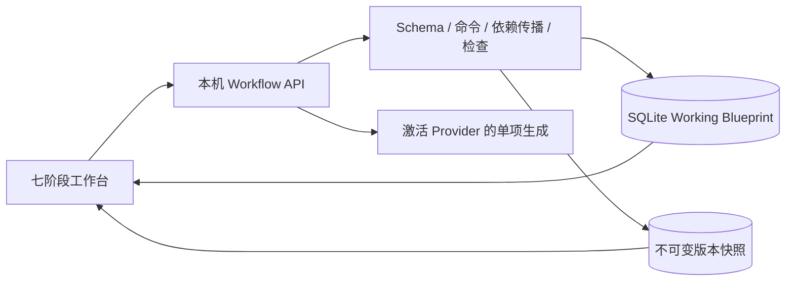

# 前置创作 Workflow 与 Game Blueprint

## 1. 背景与范围

在现有本地单人创作基底上实现游戏开始前的七阶段工作流：基础设定、人物、结局、卷与章节、章节人物变化与关键分支、SLG 系统与初始世界、总体检查。产出可编辑、可审批、可 JSON 交换和版本化保存的 Game Blueprint。

本次范围不包含正式 Runtime、Character Agent、时间 Tick、动态 Scene、正文对白、玩家存档或实际游戏流程。

## 2. 仓库认知与证据

| 模块 | 已确认职责与证据 |
| --- | --- |
| 前端 | `src/client/App.tsx` 为页面与导航入口；`ProviderSettings.tsx` 管理模型配置；`NarrativePreview.tsx` 为示例图。沿用 `styles.css` 的深色 Token 和按钮，不重构既有页面。 |
| 本机 API | `src/server/index.ts` 注册 Hono、回环监听和 Host / Origin / Fetch Metadata 防护；Vite 代理 `/api`，生产同进程托管静态页面。 |
| 数据库 | `src/server/db/index.ts` 使用 better-sqlite3 / WAL，逐项事务执行 `migrations.ts` 中的启动迁移；Drizzle schema 与实际 DDL 同步维护。现有三张业务表没有 Blueprint。 |
| Provider | `providerProfiles.ts` 提供激活配置，`secretVault.ts` 只在服务端解密；`openAICompatible.ts` 已有模型目录和 SDK 工厂，默认 8 秒超时不适合创作。`chatgptOAuth.ts` 已有授权与 Token 刷新。 |
| 共享契约 | `src/shared` 已用于前后端 DTO，可追加 Workflow 的 Zod Schema、字段定义和纯领域逻辑。 |
| 构建与测试 | `npm run build` 构建前端和后端；前端严格类型检查需另外运行 `tsc --noEmit`。原项目没有测试套件，本次使用 Node 内置测试运行器及现有 tsx，不新增测试依赖。 |

现有 README 的 SIWC 未实现说明与代码不一致，应在交付阶段更新。真实 Provider 资格、额度及模型创作质量不由本机模拟验证证明。

## 3. 需求与验收契约

- 固定结构从已知数据构建大纲；人物、结局、每章关键分支、系统清单先规划、再审核，确认之前不创建详情、不自动批量生成。
- 每次只生成一个审批单元；拒绝、修订、保持原内容并重新审批均有明确状态。
- 所有必需单元 APPROVED 才能确认阶段，下一阶段需前置阶段已确认。
- 任何已批准前置内容变化都保留后续数据，通过依赖图传播 NEEDS_REVIEW；总体检查同步失效。
- JSON 输入需类型、必填、版本、引用和未知字段检查；展示摘要后再次确认才替换工作数据。
- Working Blueprint、阶段、选择对象、清单、审批和复审状态落盘；模型任务状态先持久化，失败或重启可恢复。
- Finalize 需全部阶段通过、检查报告最新且没有 ERROR；Create Version 可保存创作中的快照。版本不可变，可查看、比较、复制为 Working Version。

## 4. 设计取舍与影响范围

采用共享领域契约 + 服务端命令边界 + SQLite 工作文档与版本表。复杂创作内容以受 Schema 校验的 JSON 保存，阶段转换不相信浏览器提交的状态。相较把全部对象拆成独立表，此方案适合现有本地单用户规模，避免引入无关 ORM 重构；后续若跨项目检索成为需求，再按查询模式拆表。

并发写入使用工作文档 revision 乐观锁，避免两个标签页互相覆盖；AI 请求不持有 SQLite 事务，回写须校验生成标识与输入版本。每项目只允许一个活跃生成单元，UI 轮询真实状态，不虚构百分比。参数化 SQL、输入体积限制及既有本机安全中间件覆盖新增路由。

对结构化生成，复用激活 Provider 与服务端凭据路径；兼容中转走 Chat Completions，计划授权走 Responses。模型输出再经 Schema 和引用校验，不能写入审批状态或悄悄扩张已确认清单。

## 5. 分阶段实现与提交

1. 领域：Stage FIXED / AI_PLANNED、Outline Plan、Approval、实体字段、依赖图、检查规则与契约测试。
2. 服务端：追加迁移、工作文档与快照保存、导入预览/确认、导出、AI 单项生成与错误恢复、API 集成测试。
3. 前端：导航增量接入，七阶段与三栏编辑，清单审批、基础输入、生成审批、复审、导入导出和版本面板，自动/手动保存。
4. 验证：全流程与异常场景、数据库重开恢复、浏览器交互、构建、类型检查和安全复核，更新 README 与本文。

每个阶段完成编码与相应验证后，按历史 `feat: 中文说明` / `fix: 中文说明` 格式本地提交，不自动推送。

## 6. 验证计划与风险

- 领域测试：未经批准清单不得生成，逐项审批顺序，固定结构展开，前置修改复审传播，未处理 ERROR 阻止 Finalize，非法/未来版本 JSON 拒绝。
- SQLite / API 集成：临时数据库、冲突 revision、不可变快照、导入失败保留原数据、重开恢复、生成失败恢复、陈旧 AI 输出丢弃。
- Provider 模拟：本机模拟 JSON 输出验证真实 HTTP 请求与 Schema 边界，禁止使用真实数据库覆盖测试。
- 浏览器：基础设定输入与保存、刷新恢复、清单编辑与确认、实体审批、版本查看和导入预览；真实服务商模型和叙事质量另行验证。

风险为中：新增一条核心创作数据流。主要防护为追加迁移、事务、乐观锁、明确审批门禁、导入二次确认及不可变快照。未知 Schema Version 先拒绝，预留版本迁移入口，不猜测转换规则。

## 7. 实施进展与实际结果

### 阶段一：领域与审批规则

已新增 `src/shared/workflow.ts` 与 `workflowEngine.ts`：Zod Schema、完整字段、七阶段状态派生、清单审批后建实体、单项生成顺序、固定卷章与每章分支作用域、依赖传播、总体检查与 Finalize 门禁。命令返回新副本，避免修改调用者输入。AI 输出只允许当前单元的内容，不能提交 ID、批准状态或跨阶段内容。

阶段一实际验证：`node --import tsx --test tests/workflow-schema.test.ts tests/workflow-engine.test.ts` 共 16 项通过，`npm run build:api` 通过，领域差异检查通过。涵盖清单门禁、用户预设保留、逐项审批、结构展开、复审传播、ERROR / 陈旧报告阻塞、取消与陈旧 token、未知字段和引用约束。

明确的保护边界：缩减已经创作的卷章结构会被拒绝，避免删除下游内容；删除已创作清单项目会保留为禁用项目。依赖图目前包含本次模型实际使用的前置阶段内容，因此复审传播较保守，可能比手工指定的关联范围更广。真实 Provider 请求与浏览器尚未在阶段一验收。

### 阶段二：持久化、生成与版本 API

追加启动迁移 `0003_workflow_blueprints`，同步 Drizzle schema；新增 `workflow_working`、`workflow_versions`，保留现有 Provider 和向量表。Working 文档用 revision CAS 保存；快照使用事务 INSERT，并以数据库触发器禁止 UPDATE / DELETE。版本链可从历史版本分叉，导入外部 Blueprint 时不伪造本地父版本。

`/api/workflow` 提供读写命令、202 后台单项生成、取消、导入预览/确认、JSON 导出及版本创建/查看/复制。所有新入口复用本机请求防护，限制请求大小并禁止缓存。模型提示词包含当前目标、批准上下文及 JSON Schema；调用不持有数据库事务，取消后迟到结果不回写。重启恢复中断状态，保留原内容并要求显式重试，避免自动重复收费请求。

AI 复用当前激活预设：兼容中转 Chat Completions；ChatGPT 计划额度 Responses 使用 `store:false`、SSE，只有 `response.completed` 才成功。这一协议来自 [OpenAI 官方 SIWC 模型与推理文档](https://developers.openai.com/siwc/token-sharing-open-source/models-and-inference)，当前只做本机模拟验证。独立生成超时为 120 秒，旧模型目录的 8 秒超时保持现有行为；不进行隐式重试。

阶段二实际验证：5 项 API / SQLite / 回环 HTTP 集成测试通过，覆盖追加迁移、原数据保留、CAS 冲突错误码、持久化生成状态、取消迟到、AI 未知字段拒绝、重启恢复、导入二次确认与体积限制、不可变快照和父版本分叉，以及模拟 Chat Completions / SIWC SSE 完成、失败和中断。`npm run build`、`npm run typecheck` 已通过。构建存在单个前端 chunk 超过 500 kB 的提示，构建成功；后续可按页面拆包。

### 阶段三：七阶段工作台

新增 `WorkflowWorkbench.tsx`、`workflowApi.ts`、`workflow.css`，只在 App 导航和页面分支增量接入。顶部阶段、左大纲、中字段编辑、右 AI 与审批控制按既有视觉规范实现；预设人物、关系、卷章、逐章人物/分支、系统和初始世界有独立审批单元。清单编辑与确认、生成/修订/拒绝/保持复审、总体检查、导入导出、历史只读查看和比较均绑定服务端契约。

编辑采用串行保存队列与 700 ms debounce，动作前 flush；本机浏览器 journal 仅备份未提交表单，SQLite 仍为权威数据源。无效 JSON 保留 raw 草稿并阻止提交；409 冲突保留草稿，由用户明确决定是否应用。导入预览及文件读取以请求序号失效陈旧结果，避免界面显示新输入却确认导入旧内容。

阶段三实际验证：严格前端/后端类型检查通过，生产构建通过；使用独立数据库和生产服务 `127.0.0.1:4336`，浏览器已验证基础输入、多行人物输入、手动保存、刷新恢复、Story Bible 整体审批、明确阶段确认、人物清单增改确认后仅出现 DRAFT、创建历史版本、未知字段导入拒绝且不覆盖。1440 px 桌面显示三栏，320 px 窄屏没有横向溢出（DOM scrollWidth 310，viewport 320）。尚未用真实模型进行浏览器完整创作；后续补充全流程 API 验收和建议审批机制。

### 领域边界修正：可选人物的初始世界参与规则

已确认原审批规则只要求必需项目通过，允许启用但 `required=false` 的人物保留 DRAFT；初始世界校验却遍历全部人物，强制这些未采用草稿具有初始地点，引用校验又要求被引用人物 APPROVED，形成阶段可确认而世界状态不能通过的冲突。

统一通过 `activeApprovedCharacters` 筛选清单启用且 APPROVED 的人物，只有这些已采用人物必须具备初始所在地与动态属性值。未采用的可选 DRAFT、已禁用但保留的历史人物继续保存在 Blueprint，不计入初始世界参与者。AI 上下文同样只提供启用且已审批的实体；若手工把未审批人物写入初始世界引用，原引用审批约束仍然生效。必需项目的审批和 Finalize 门禁保持原有要求。

新增回归测试完成包含未生成可选人物的七阶段流程和 Finalize，并验证已禁用人物不强制初始映射。实际结果：领域 / Schema 共 23 项测试通过，后端严格 TypeScript 检查通过；此结果验证领域状态规则，不代表真实模型创作质量。

### 阶段四：边界修正与完整验收

1. 新增建议独立存储、审批，不允许详情输出直接扩张大纲。批准建议只把对应清单设为 PENDING_REVIEW；再次确认清单才创建 DRAFT。AI 输出不能伪造建议 / 实体 ID、来源、作用域或审批状态。
2. 修正已创建空白详情时重新规划造成旧 ID 残留；已创作详情继续禁止整清单重新规划，保护用户既有内容。
3. 阶段门禁同时校验真实完成状态，不能靠旧确认标记推进。导入双向校验清单与实体，防止移除必需实体后跳过审批。
4. 修改卷章数量后，原卷与下游复审；可选人物初始世界规则见上一节。
5. 冲突 journal 保存显式冲突标记，读取服务器最新 revision 后刷新也不会自动重放此前冲突草稿。该问题先以失败测试复现，再修复。保存过程中继续输入和动作前 flush 也有独立回归测试。
6. 未应用卷章数量保留本机 raw 草稿并显示提示，显式应用或手动保存后才写入 Blueprint；无效 JSON 不被“已保存”提示掩盖。
7. 工作流按需加载，最终主包约 456.98 kB，工作流包约 165 kB，生产构建不再有超过 500 kB 的 chunk 提示。导出改为服务端直接下载，提示仅表示“已发起下载”。
8. 总体检查与普通实体不同，原先没有 reviewReasons，导致异步失败恢复后缺少可见原因。统一持久化 generationError，工作台显示错误并在重试时清除，取消也保留准确反馈；新增失败 / 重试回归测试。

最终实际验证：

| 验证 | 结果与证据边界 |
| --- | --- |
| `npm test` | 34 项全部通过：API / SQLite / Provider 模拟 5，保存控制器 4，领域 18，Schema 6，完整生命周期 1。 |
| `npm run typecheck` | 前后端严格 TypeScript 检查通过。 |
| `npm run build` | React/Vite 和后端生产构建通过，无大包警告。 |
| 七阶段生命周期 | 通过实际 Hono Workflow API 与临时 SQLite，逐个单元请求确定性模型夹具，完成 Finalize、JSON 导出重导入；前置人物编辑保留下游并使 Finalize 失效，历史快照保持原值。 |
| 浏览器与服务重启 | 隔离生产服务重启后，工作阶段、清单、审批、当前对象和历史恢复；版本只读查看与工作副本比较通过。 |
| 新增建议卡 | 测试数据通过校验导入后，浏览器批准 Teacher 建议：清单 3 项、人物仍 2 名且清单 PENDING_REVIEW；再次确认后才新增 Teacher DRAFT，没有自动生成。 |
| 下载 | 浏览器捕获实际 download，文件落在 `C:\Users\Xie\Downloads\game-blueprint.json`；读取确认 Schema Version=1、标题为本地验收故事、当前人物阶段、两名人物及已批准清单。此文件仅为验收样本。 |
| 本机边界 | 实际生产服务对伪造 Host、跨站 Origin 和 Sec-Fetch-Site 均返回 403；正常本机 Workflow 请求为 200。 |
| 视觉 | 1440 px 三栏和 320 px 无横向溢出均检查；验收截图保存于本次会话的 visualizations 目录。 |

本机验收服务已经停止；测试只使用隔离数据，不替换用户的真实 Provider 配置和现有数据库。没有发送真实服务商创作请求。真实 ChatGPT 账户资格、令牌刷新、额度、所选模型兼容性与叙事质量仍需实际接入验证，不能由模拟 HTTP 或 Schema 通过证明。

## 8. 最终交付与可复用判断

已完成前置创作全流程与 Blueprint 的 JSON 交换、工作副本保存、不可变版本、审批和依赖复审。没有引入正式 Runtime、Scene、Character Agent 或玩家存档实现。当前提供一个本地工作副本，单项目生成串行；保存 5 MiB、提示词 2 MiB、最多 500 章的边界均有明确错误反馈。

关键价值是把“准备生成什么”和“生成结果是否采用”分别交给用户确认，并将批准的数据、生成中状态、复审依赖和版本快照都保存为可恢复的权威数据。Schema 和结构检查防止机器可判定的越界与不一致；人物 OOC、故事主线和伏笔语义仍依赖 AI 检查与作者审批，未宣称自动证明叙事正确。

后续可在真实 Provider 验收后，按实际内容规模优化上下文选择、细化依赖粒度。复杂属性 / 选项结构编辑已在第 9 节的后续迭代中补齐。若需要修改已经创作的卷章数量并移除结构，应先设计显式归档与引用迁移流程，不能默默删除下游。

本地阶段提交沿用历史格式：`2b3682a` 领域与审批、`8ceaa84` 持久化与生成 API、`fc77d0b` 工作台 UI；第四阶段以 `feat: 完善新增建议审批与前置创作回归验证` 提交。本次不推送远端。

## 9. 表单创作体验与单向阶段依赖改进（2026-10-08）

### 9.1 反馈、已确认问题与目标

用户要求将右侧“修改意见”变为明确的 AI 表单填充：输入 prompt 后填充当前表单，允许多选具体字段，已有值可按意见修改；优化每个字段的新人提示；将文本列表改为可增删条目；按照字段用途设置单行、短段落和长文本；严格只允许后置阶段引用前置阶段。

已确认现状：所有 text / textList 在 `WorkflowWorkbench.tsx` 共用大 textarea，提示主要是字段标签与“每行一项”，复杂字段要求直接编辑 JSON；人物 Outline 的 `volumeNumbers` 绑定尚未配置的第四阶段卷结构；`relatedIds` 的 UI 枚举全项目对象且服务端只检查 ID 存在；`getGenerationTarget` 向前置对象发送全部已批准实体。这些问题分别影响可发现性、填写成本和阶段方向一致性。

用户在基础输入中写出的预设人物、事件、分支、结局属于文字创作意向，可在正式后置实体形成前提供；它们不是正式实体 ID 关联，应保留并解释清楚。当前问题应修正正式跨阶段引用，而不是删除作者提前表达想法的能力。

### 9.2 方案与影响

- 共享引用规则控制 UI 候选、Schema / 命令检查、生成上下文和依赖图。只允许前置实体及明确的同阶段上游（例如人物关系总览引用已审批人物、章节引用本卷、分支引用本章人物计划），不接受自己、后置和无关同级引用。
- Blueprint Schema 升级为 v2，提供 v1 读取迁移。退役预计卷号的结构化绑定，旧意向以说明保留；旧版反向关联解除并标记复审。历史数据库快照原始 JSON 不更新，读取时投影到当前契约，Working 后续保存使用 v2。
- 新增 `/fill` 单项后台任务，按目标与勾选字段构造严格部分 Schema。基础输入可以直接从 prompt 起步；选中字段必须由模型返回，未选择字段保持原值，固定结构序号不能交给 AI 改写。部分填充可以保留未完成字段，审批继续使用完整验收规则。
- 第一阶段明确区分“基础创作表单”和“故事设定整理（Story Bible）”；所有实体详情都有 prompt、字段多选和准确的填写反馈。清单规划与最终检查仍保留各自明确审批动作，不把字段填充变成隐式范围扩张。
- 按字段逐项定义说明、示例、控件宽高与分组。标题 / 类型 / 时间等使用短单行，背景与概要使用不同高度的段落，文本列表使用独立条目；复杂属性、关系、选择等优先结构化编辑，高级 JSON 仅作为可选入口。

整体风险 High：涉及共享 Schema、持久化 JSON、AI 异步回写与前端联动；不改变数据库表和 Provider 凭据架构。以迁移纯函数、严格字段白名单、同一生成 token / contentRevision 校验和不可变历史保护降低风险。

### 9.3 阶段与验证计划

1. 方向与 AI 表单 API：验证 v1→v2 数据保留、历史只读、非法前向引用拒绝、前置 prompt 不包含后置内容、局部填充只覆盖勾选字段、空基础表单生成、失败/取消/重启和迟到输出保护；完成后本地提交。
2. 表单 UI：验证单行与段落字段、条目增删与空草稿、结构化编辑、两类基础表单切换、多选生成、自动保存/刷新和引用候选，运行类型 / 构建 / 全部回归并做隔离浏览器验收；完成后本地提交。

实际修改和验证结果将继续更新本节，暂未完成的检查不标记通过。

### 9.4 领域与接口实现

`workflow.ts` 提供 `entityStage`、`canReferenceEntity`、`allowedReferenceEntities` 与统一依赖重建；命令、导入检查和生成上下文共用这套规则。正式人物清单不再携带 `volumeNumbers`，卷章结构只在第四阶段由作者配置。Schema v1 的读取迁移不修改输入对象，也不更新数据库原始快照；需要调整的清单与实体标记复审，下游确认和最终检查失效，既有正文保留。

`workflowFormAI.ts` 提供字段白名单、严格局部输出 Schema、填充门禁和普通命令合并。`POST /api/workflow/fill` 接收 `revision / targetId / prompt / fields`，返回已持久化任务并复用既有后台请求、取消、失败恢复与过期结果保护。基础表单使用独立 `story-input` 虚拟目标，不把 Story Bible 临时改为生成中；实体按选中内容键合并；已有清单要求原 ID 集合各返回一次，只填选中列，不允许新增条目或修改数量。固定卷章序号、来源、审批状态和结构不能由填充请求改写。

严格 Schema 要求选中的列表字段也实际返回，不能因为原草稿有默认空数组而静默漏填。新增正式引用须来自已采用、已审批的合法前置对象；前置表单上下文同时剔除后置实体与 `volumeChapterCounts`。未选字段保持原值；完成后进入人工审核，通过普通修改链传播下游复审，AI 不自动审批。

审查发现并修复原有名称一致性问题：实体修改名称后，所属清单仍保存旧名称，之后再次确认清单会把名称覆回。名称现在与所属清单同步，保留来源和人工修改标记，不隐式重新规划清单；清单其他字段再次确认不会撤销已采用名称。

验证采用隔离 SQLite 和可控模型输出，不发送真实服务商请求。第一编码阶段的全部 46 项回归通过，覆盖新增 `/fill` 的五组集成用例、名称回滚、七阶段 API 生命周期、控制器保存竞争及原始历史 JSON 保护；后端构建通过。新项目默认打开基础创作表单，已有保存选择保持。UI 的实际浏览器验收继续在下一阶段记录。

### 9.5 表单交互与新人指引

`workflowFields.ts` 逐项描述基础输入与每种实体字段的含义、示例、短输入或段落尺寸；英文契约键保留，界面将 Premise、章节结束条件和必需 / 可选 / 禁止事件改为中文含义。字段标签、说明和输入字号提高，填写说明不依赖占位文本；名称、类型、时间占较短宽度，背景、大纲等使用更宽且不同高度的文本区域。

`WorkflowFieldEditors.tsx` 的文本条目支持添加、删除、Enter 新增、Shift+Enter 换行与稳定条目 ID，保留作者实际输入的空格。空白行仅保留本机草稿，不向 Schema 提交空字符串。动态属性、人物关系、章节人物状态、普通 / 隐藏选择、初始人物映射、玩家数值、标记和系统参数使用结构化控件；高级 JSON 默认折叠，用于批量输入或复杂配置。

结构化无效草稿保存在浏览器，不覆盖服务端合法内容。审查实际复现了旧草稿 `characters[].attributeChanges:[null]` 可能导致首屏读取 `change.key` 崩溃，新增递归的安全呈现守卫，非法嵌套列表继续保留在高级输入中。参数名称为空或重复时不静默合并，保留本机草稿并阻止依赖操作。新增 SSR 回归覆盖这些恢复边界和所有字段提示的可呈现性。

右栏统一为 AI 生成、要求输入和字段多选，支持全选 / 取消全选并显示选择数量。调用前控制器先提交已有有效修改；基础输入无需预先填满必需项。填充完成后保留未选内容，实体待审批、清单待确认；空清单仍使用清单规划，已有条目可以按列填写，最终检查仍只产出检查意见。

浏览器已确认：空基础表单的名称 / 类型 / 大纲多选填充，后续只改名称时保持手填类型和原大纲；标签 Enter 后焦点移动到下一条，删除首项保留后一项，空条目刷新恢复而服务端仅保存非空项；Story Bible 多选填充后保持名称并进入待审核，人工审批后阶段确认可用；人物属性增项保存后，下游结局变为 NEEDS_REVIEW；章节人物计划、隐藏选择和初始世界映射按结构化控件展示，高级 JSON 默认折叠。

浏览器实际发现数值控件将空输入立即转换成 0，逐键输入 `-5` 时负号丢失。控件改为持有原始文本，只在完整数值时提交；未完成负数或小数保留本机草稿并阻止后续操作，数值错误提示不改变控件可访问名称。最终浏览器逐键输入 `-5` 和 `-.5` 成功，焦点保留、错误清除，API 读取玩家 `insight=-0.5`；空串和 `0-` 在新页面恢复为可修正草稿。初始地点与可访问地点直接从 Story Bible 的实际地点选择，避免照抄示例而引入不存在地点。

### 9.6 最终验证与边界

| 验证 | 实际结果 |
| --- | --- |
| 全部自动回归 | `npm test`：50 / 50 通过，包含 4 项新增编辑器 SSR 回归。最后的可访问名称调整后，该 4 项再次通过。 |
| 类型与构建 | `npm run typecheck` 和 `npm run build` 通过；最后提示文案调整后 `build:web` 再次通过。 |
| 单向候选 | 已完成项目回到人物清单，关联候选只有 Story Bible，没有人物自己、后置结局、卷章或系统；预计卷号输入已移除。 |
| 最终构建实机浏览器 | 基础表单勾选名称 / 类型 / 大纲，三个字段由本机可控模型输出填入，无错误，服务端任务完成且选中对象恢复为 `story-input`。 |
| 窄屏 | 最终构建 320 px：文档和内容宽度 310 px，字段无右侧溢出。1440 px 三栏及不同输入高度已检查并截图。 |
| 草稿与持久化 | 列表空草稿、结构化非法 JSON、未完成数值分别保留本机；有效数据经同一控制器写入隔离 SQLite。服务器只保存有效非空列表和完整数值。 |

验收截图位于会话 visualizations 的 `workflow-form-preview.png`。测试服务只使用独立数据库和确定性模型边界，不修改真实 Provider 配置；未调用实际外部模型，因此真实服务商额度、账户权限与生成内容质量仍未验证。Schema v1→v2 的旧版读取兼容已验证，但迁移后解除非法方向关联的内容需要作者重新审批，这是明确的数据规则变化。

第一阶段本地提交为 `eb522df feat: 接入AI字段填充并约束前置创作引用方向`。第二阶段以 `feat: 优化创作表单提示与结构化AI填写体验` 本地提交；未推送远端。
