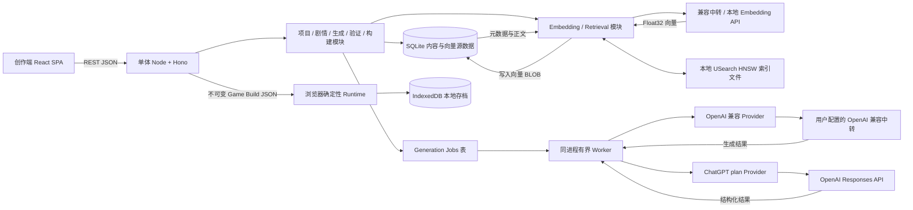

# Project Chronicle MVP 轻量化技术栈选型

- 日期：2026-10-07
- 输入文档：[PRODUCT_SPEC_AI_NARRATIVE_SLG.md](../../产品文档/PRODUCT_SPEC_AI_NARRATIVE_SLG.md)
- 适用阶段：概念验证 / MVP
- 结论状态：用户已确认采用本地单人技术栈、SQLite + USearch HNSW、本地 BGE-base-zh-v1.5 量化 ONNX 模型，并计划公开开源。脚手架与依赖已建立；本地模型运行时和 Provider 设置已实现，验证状态见第 10.4 节。商业分发方式、真实 OpenAI 账户授权和 Responses API 调用仍待确认。

## 1. 背景与目标

产品的核心是把 Story Bible 编译成结构化剧情图，再通过确定性 Runtime 执行。MVP 包含创作编辑器、叙事图、AI 生成和验证，以及时间、地点、属性、道具、存档和结局；建议规模为 3 个主要角色、100–150 个 Scene、5–10 万字。文档明确暂不做多人、复杂经济、AI 配音、视频、3D 和开放世界。

因此，MVP 的成本主要来自剧情编辑与验证、模型调用和内容持久化。用户进一步明确希望有向量索引检索；本次将方案修订为 SQLite 保存项目和权威向量、USearch 提供嵌入式 HNSW 索引，不需要启动 PostgreSQL 服务。

产品文档已经给出 Modular Monolith 的方向。Spring Boot、PostgreSQL、Redis 和 Object Storage 出现在示例栈中，不是产品的固定技术约束。本方案保留模块化单体，按 MVP 的单实例和低写并发假设，减少必须部署的服务。

### 已确认事实

- 创作阶段大量调用 AI，运行阶段优先由确定性游戏逻辑执行。
- Story Bible、人物、场景、选择、条件、效果、结局等需要结构化和 Schema 校验。
- 大型生成需要异步任务、进度、重试、成本记录和依赖关系。
- 游戏构建内容需要冻结和版本化；存档需要可确定地恢复。
- 作者内容可能是商业 IP，需隔离项目、保护凭据并支持导出。
- 用户补充：目标是本地私人单人部署，不按公网多用户产品设计。
- 用户要求可配置 OpenAI 协议兼容中转站；同一接入层还应提供 OpenAI 账户授权，尝试使用其符合条件的 ChatGPT Plus 订阅额度。
- 用户明确要求支持向量检索，并进一步指出仅保存向量后全量扫描不满足“向量索引检索”的预期。

### 暂定假设

- 应用运行在用户控制的本机环境，默认只绑定 `127.0.0.1`；暂不提供多人实时协作、云存档或公网注册。
- MVP 主要是文字内容，尚无必须长期保存的图片、音频或视频资产。
- 用户可配置远程中转站或本地 OpenAI 兼容服务；“本地部署”本身不代表 AI 请求和提示词不会发给所选服务商。
- 首版内容规模与产品文档相近；对宽范围检索使用嵌入式 HNSW，对强元数据过滤的小候选集保留精确重排；当前尚无真实语料基准。
- 目标产品方向准备公开开源；是否商业分发/盈利仍待确认。OpenAI 的开源客户端文档提供动态注册和 ChatGPT plan usage 的授权流程；是否能实际使用仍以返回的授权 scope、账户订阅资格和服务响应为准。
- 团队没有指定必须使用 Java、Python、Vue 或既有云平台。

如果应用改为供其他用户远程访问，应重新评估认证、授权、租户隔离、密钥托管、网络请求限制和数据库；不能把本地单用户安全边界直接沿用到公网。

## 2. 推荐栈一览

| 层 | 推荐 | MVP 取舍 |
|---|---|---|
| 前端 | React + TypeScript + Vite SPA | 创作端和玩家端共用一个 Web 应用；不引入 SSR |
| 叙事图编辑 | `@xyflow/react` | 只负责画布交互；剧情图数据和规则保存在自己的领域模型 |
| API / 服务端 | Node.js LTS + TypeScript + Hono | 一个 Node 进程提供 REST API、静态前端和轻量后台任务 |
| 架构 | Modular Monolith | 按领域分模块，不拆服务、不建 monorepo workspace |
| 关系数据 | SQLite + `better-sqlite3` + Drizzle ORM | 单机持久化；短事务；数据库文件放持久化磁盘 |
| 向量检索 | SQLite 向量 BLOB + USearch HNSW 本地索引 | SQLite 为权威数据；HNSW 索引是可重建文件；不增加数据库服务 |
| 生成任务 | SQLite `generation_jobs` 表 + 同进程 Worker | 限制并发，支持状态、进度、重试和幂等；前端轮询 |
| AI 接入 | `openai` Node SDK + 自定义 `LLMProvider`；OpenAI 兼容中转与 ChatGPT 订阅分开适配 | 中转用用户配置的 `baseURL` / API Key；开源客户端走官方 Sign in with ChatGPT 动态注册与本地授权流程，Plus / Pro 计划使用需获得对应 scope |
| Embedding | 独立 `EmbeddingProvider`，优先使用所选中转站的 `/embeddings`；兼容本地 OpenAI API 服务 | ChatGPT plan usage 当前按 Responses API 权限设计，不能当作 Embedding API 凭据；服务不支持 Embedding 时可选本地模型或更换服务 |
| 规则与验证 | TypeScript 确定性引擎 + JSON AST DSL | 不执行模型生成的任意代码；运行图遍历和有界状态搜索 |
| 玩家存档 | 浏览器 IndexedDB | 本地存档；提供导出/导入；跨设备同步留待账号版 |
| 上传文件 | 本机私有目录 | MVP 尚无资产服务需求；公网多实例时改用对象存储 |
| 搜索 / 记忆检索 | USearch HNSW 候选检索 + SQLite 元数据过滤 + 精确重排 | 按项目/Embedding 模型分索引；小范围过滤查询可走 SQLite 精确搜索 |
| API 协议 | REST + JSON | 适合单一 Web 客户端和异步任务；不需要 GraphQL 或 gRPC |
| 部署 | 本机 Node 服务 + 本地 SQLite 文件 | 默认回环地址运行；不要求 Docker、Kubernetes、Redis、服务网格或独立 Worker 集群 |

## 3. 目标结构

前端只提交项目数据、编辑操作和任务请求；模型密钥、提示词拼装、内容验证与发布构建均留在服务端。发布后的 Game Build 是带版本号的不可变 JSON 包，浏览器 Runtime 使用同一套 TypeScript 规则执行剧情状态和选项。

## 4. 关键选型与候选比较

### 4.1 创作端框架与图编辑器

| 候选 | 适合点 | 成本 / 风险 | 判断 |
|---|---|---|---|
| React + Vite + React Flow | React Flow 专门支持可交互节点编辑，提供拖拽、缩放、选择和自定义节点；Vite 直接构建静态资源 | UI 和 API 分为前后端目录，开发时有两个本地服务；生产时仍可由一个 Node 进程托管 | **推荐**：叙事图是产品核心，优先选近期持续发布、文档和示例成熟的编辑组件 |
| SvelteKit + Svelte Flow | 页面、API 路由可由同一框架承载，运行单元少 | Svelte Flow 项目 README 仍标为 alpha；核心编辑器依赖 alpha 组件增加风险 | 暂不选；若 Svelte Flow 稳定且团队熟悉 Svelte，可重新评估 |
| Vue 3 + Vite + Vue Flow | Vue Flow 提供 Vue 3 节点画布；适合已有 Vue 团队 | Vue Flow 2.0 仍处于预发布阶段；继续用 1.x 可行，但升级路径需要跟踪 | 若团队已有 Vue 经验，这是合理替代；在没有团队偏好的情况下，优先 React Flow |

React Flow 的 GitHub 发布记录显示 `@xyflow/react@12.12.0` 于 2026-09-24 发布；官方文档展示节点编辑能力和实际使用项目，并标注 MIT。画布默认显示项目 attribution；MVP 保留该标记，若之后要隐藏，按届时官方说明评估。Svelte Flow 的 README 仍说明组件在 alpha 阶段；Vue Flow 的 2.0.0-next.1 于 2026 年 6 月发布。版本状态和生态比较见“资料来源”。

建议先实现一个支持搜索、过滤、条件标记和路径高亮的 Graph Editor，不做完整低代码画布。节点位置是编辑器布局数据；节点内容、条件和效果属于独立的剧情领域数据。React Flow 不作为规则引擎，也不把其内部 Store 当作数据真相源。

### 4.2 服务端与应用架构

- 使用 TypeScript 贯穿 UI、API、规则引擎和 Schema，减少跨语言 DTO 维护。
- 选择 Hono + Node.js LTS，API 使用 REST JSON；Node 适配器可承载静态文件与 API。
- 一个进程内按领域拆为 `project`、`story`、`character`、`narrative`、`generation`、`validation`、`runtime`、`build` 模块。
- 不引入 NestJS、Spring Boot 或微服务框架来管理尚未形成的服务边界。若团队已经以 Java 为主，可保留 Spring Boot 单体，继续删去当前无需求的 Redis、独立对象存储和服务拆分。

Hono 的官方 Node 指南提供 Node 适配器、静态文件服务和单进程启动方式；截至调研日 GitHub 发布到 4.13.13。部署时需锁定受支持版本，并跟进其安全修复。

### 4.3 数据库：SQLite 还是 PostgreSQL

| 方案 | 优点 | 限制 | 适用边界 |
|---|---|---|---|
| SQLite | 无独立数据库服务；一个文件；部署和备份简单；适合低写并发的单机应用 | 一个数据库文件同一时刻只有一个写入者；单文件依赖可靠的本地持久盘 | **MVP 推荐**：一个应用实例、任务 Worker 有界、事务短 |
| PostgreSQL | 客户端/服务端数据库，适合多应用实例和较高并发写入 | 需要额外数据库服务、连接与备份配置 | 多租户公网服务、多实例或并发写入成为实际需求时采用 |

SQLite 官方建议：如果应用与数据位于同一台机器、写并发较低，SQLite 是简单选择；很多并发写入、数据库和应用分处不同主机、或需要多台应用服务器时，应选择客户端/服务端数据库。SQLite 仍只允许一个 writer 同时写入，因此本方案限定单实例并将写事务保持很短。

使用 `better-sqlite3` 作为 Node 驱动，Drizzle 管理表结构、类型和迁移。Node 内置 `node:sqlite` 在当前官方文档中的稳定性仍为 Release Candidate，MVP 暂不依赖该接口。Drizzle 当前稳定发布线为 0.45.x；其 1.0 版本仍有 RC，建议使用稳定版并锁定依赖，不追逐预发布版。

数据模型按访问和一致性需求渐进拆分：

- 关系表：`projects`、`project_versions`、`generation_jobs`、`game_builds`、`game_events`。
- 场景、人物、Story Bible 等复杂内容存版本化 JSON，并保留 `schema_version`、`parent_version`、`prompt_hash`、`model` 和状态。
- Narrative Node / Edge 可以独立存表，便于验证和索引；每个 Node 的内容载荷仍可为受 Schema 校验的 JSON。
- 向量放入同一 SQLite 文件的 `memory_chunks` 表，至少记录来源项目/版本/实体、文本摘要或引用、`embedding_model`、`dimensions`、内容哈希和 Float32 BLOB。正文与向量是权威数据；USearch 索引文件只是可删除、可重建的 ANN 加速索引。
- 对需要 HNSW 的检索，使用 USearch Node.js SDK 建立每个项目/Embedding 模型对应的本地索引，以 SQLite 行 ID 作为 64 位向量键。查询先从 HNSW 取多于目标数的候选，再按角色、场景、版本等约束做 SQLite 元数据过滤和精确重排；极窄过滤条件则直接对过滤后的 SQLite 候选做精确搜索，避免 HNSW 后过滤把相关结果截掉。
- 更新流程先在 SQLite 事务中写入向量及内容哈希，再更新 HNSW 文件；若进程在两个步骤之间退出，将索引标记为 dirty 并从 SQLite 重建。索引元信息需包含项目、模型、维度和源数据版本。内容生成/批量编辑完成后合并更新；删除或频繁重排时重建单个项目索引并原子替换，避免索引长期累积更新痕迹。查询时仍需用 SQLite 校验候选 ID 和当前版本。
- USearch 是嵌入式 HNSW 库，可通过 Node.js 包 `usearch` 调用并保存/恢复独立索引文件；官方文档列出 JavaScript、Windows 等支持，GitHub 2.26.0 发布记录增加了 Windows x64 JavaScript 预构建产物。它没有 PostgreSQL 那样把关系数据、元数据过滤和向量索引放在同一 SQL 事务中，因此应用需维护 SQLite 与派生索引的一致性。
- 若希望向量 SQL 与关系数据完全合并，可评估 `sqlite-vec`；其稳定发布能力适合轻量 KNN，但当前 HNSW/DiskANN/IVF 索引仍在 pre-v1 alpha。若需要更成熟的 SQL 原生 ANN、复杂过滤和统一事务，则迁移主数据库为 PostgreSQL + pgvector；不建议仅为当前单机规模额外运行 PostgreSQL。
- 关键关系和不变量放在数据库的外键、唯一键、非空和检查约束中，不只依赖前端或模型提示词。
- 对玩家状态记录关键事件，同时保存可恢复的 State 快照和事件游标；MVP 不必为每个领域对象搭建通用 Event Sourcing 平台。

SQLite 到 PostgreSQL 不是零成本切换。若确定第一版即为公网多租户产品，建议直接选托管 PostgreSQL，并在首次上线前确定认证、租户隔离、备份和数据保留策略。

向量索引候选按“是否提供 ANN 索引”和本地运维量比较：

| 方案 | ANN 向量索引 | 本地部署成本 | 对本产品的判断 |
|---|---|---|---|
| SQLite BLOB + TypeScript 相似度 | 否，完整扫描/精确 Top-K | 最低；只有一个 SQLite 文件 | 适合作为小候选集基准和过滤后重排，不满足“必须使用 ANN 索引”的要求 |
| SQLite + `sqlite-vec` | 当前稳定发布提供向量 KNN；新 DiskANN/IVF 实现仍是 alpha | 低；SQLite 扩展需要打包和加载 | SQLite 集成好，但当前 ANN 索引成熟度不足以作为首选 |
| SQLite + USearch | 是，HNSW 近似最近邻 | 低到中；无数据库服务，但增加 Node 原生模块和一个可重建索引文件 | **最终采用**：在本地单人模式下获得真实 ANN，同时保留 SQLite 做唯一权威数据源 |
| PostgreSQL + pgvector | 是，HNSW / IVFFlat | 中到高；需安装并运行 PostgreSQL、启用扩展并备份数据库 | **可选**：若要关系数据与向量同库同事务、复杂 SQL 过滤、多客户端并发或未来服务端部署，则值得直接采用 |

pgvector 的 HNSW/IVFFlat 是 PostgreSQL 的成熟扩展能力，能把业务关系、向量、过滤条件和事务放在一个数据库中；代价是用户本机需额外安装和维护 PostgreSQL。pgvector 官方说明近似索引会以召回率换查询速度，并且过滤条件可能在 ANN 扫描后应用，需要按实际过滤比例调整查询配置。USearch 的 JavaScript binding 目前没有通用过滤谓词接口，所以本方案按项目/Embedding 模型分索引，对角色、时间等细过滤做过量召回后过滤和精确重排；过滤范围太窄时直接扫预过滤结果。

### 4.4 生成任务与实时进度

产品文档已要求大型生成异步化。MVP 可以用数据库表实现任务持久化：

`generation_jobs` 至少保存 `id`、`project_id`、`type`、`status`、`progress`、`idempotency_key`、`retry_count`、`input_hash`、`model`、Token 用量、成本、错误摘要和时间戳。对 `idempotency_key` 建唯一约束，防止网络重试重复创建任务。

同一 Node 进程只启动一个有并发上限的 Worker；浏览器使用 REST 轮询查询进度。模型调用期间不持有数据库事务。进程重启后恢复排队任务，将超时的 running 任务按幂等策略重试。这样无需 Redis、BullMQ、Celery、Temporal 或 WebSocket 服务。

当任务需要多台 Worker、跨实例租约、严格执行 SLA 或大量并发时，再把任务表迁移到 PostgreSQL 队列、BullMQ/Redis 或托管任务队列，并将 Worker 独立部署。

### 4.5 AI Provider、兼容中转与 ChatGPT 订阅

定义小型内部接口 `LLMProvider`（结构化生成、文本生成、流式输出）和 `EmbeddingProvider`（批量生成向量）。产品业务只依赖该接口，不依赖具体厂商 SDK 的响应对象。MVP 使用 TypeScript + Zod 校验；无需为了几个模型调用引入 Agent 或编排框架。

**OpenAI 协议兼容中转：**使用官方 `openai` Node SDK，用户在本地设置中填写 `baseURL`、API Key、模型名及可用能力。MVP 建议先实现 Chat Completions；Responses、JSON Schema 结构化输出、Embedding 和流式能力按供应商逐项探测/配置，不把“兼容 OpenAI”理解成每个接口、参数和错误格式完全一致。Schema 约束在客户端做 Zod 校验，服务端继续执行剧情领域校验。SDK 支持自定义 `baseURL`，也暴露 Chat Completions 和 Embeddings 接口。

**ChatGPT 计划额度：**OpenAI 官方为开源客户端提供本地动态注册流程。首次登录以 `dynamic_agent_client` 发起注册，回调取得签发的 client ID 后按账户保存；后续登录复用该 client ID。使用 OAuth/PKCE、OIDC ID Token 验签、用户本地令牌存储和单独的 Responses API 权限。本仓库直接实现协议，没有增加早期 `@siwc/local` DevKit 运行依赖；不把 ChatGPT token 当成 API Key，也不伪装成普通 OpenAI 中转。只有 token endpoint 返回的授权 scope 含 `chatgpt.tokens.use.direct` 时才允许标记计划额度授权。Eligible Plus / Pro 用户和可用额度仍受 OpenAI 账户及请求资格限制，不允许共享额度。

开源动态注册流程是当前产品方向对应的授权方案；具体 OAuth 回调、平台权限、token scope 和账户订阅仍需真实账户验证。官方 `@siwc/local` DevKit 不是当前实现依赖；该 DevKit 的版本、发布状态与许可证不改变本项目自行实现公开 OAuth 流程的事实。若未来考虑引入 DevKit 或商业分发，应重新核对其当前许可证及 OpenAI 条款。OpenAI 兼容中转仍作为独立备用路径，其费用与 ChatGPT 计划订阅分开。

**向量 Embedding：**通过独立 Embedding Provider 调用所选中转的 `/embeddings`，或指向兼容 OpenAI API 的本地推理服务。OpenAI 的 ChatGPT plan usage 集成目前授权的是 Responses API 请求，不能依赖 Plus 授权生成 Embedding；需有独立的 Embedding 服务/模型。模型不可用时明确标记索引待生成，允许用户更换兼容服务或本地模型。配置远程中转会把发送给该中转的文本/提示词交给该服务处理；本地存储不等于端到端本地推理。

Provider 配置需保存协议类型、端点、模型名、可用能力、超时与重试策略；API Key 和 SIWC 令牌在服务端本地安全存储，并在日志中脱敏。不得把凭据注入 `VITE_*` 或返回浏览器。固定调用流程由生成 DAG 管理，不让模型自主获得任意工具或系统命令执行能力。

模型返回符合 JSON Schema 不等于剧情逻辑正确。服务端仍要验证未知 Flag、条件字段、道具来源、时间约束和结局可达性，再允许内容进入下一阶段或冻结。

### 4.6 运行时、规则语言与存档

- 把规则引擎写成纯 TypeScript 领域模块，状态转移为确定性函数，AI 不参与关键状态变更。
- Condition / Effect 使用受限 JSON AST，例如 `and`、`or`、`not`、数值比较、Flag 查询和白名单操作；解析和执行器只识别已定义节点，禁止 `eval`、动态导入或任意脚本。
- 使用显式图算法执行可达性和路线检查。静态检查遍历图；带状态路径搜索要做状态去重并设置上限。搜索达到上限时结果应标记为“未能判定”，不能误报为“不可达”。
- 发布后生成不可变 JSON Game Build，运行时可在浏览器本地执行。玩家 Save 使用 IndexedDB，提供导出/导入；IndexedDB 属于浏览器存储，不能作为作者项目的唯一备份。
- 若要求跨设备同步或账号级云存档，将 Save 写入服务端并补充认证、所有权校验和并发版本控制。

## 5. 安全与数据一致性边界

1. Story Bible、导入文档、AI 返回文本都视为不可信数据；上传内容不能覆盖 System Prompt 或安全策略。
2. 本地服务默认只监听 `127.0.0.1`；设置合法 `Host` / `Origin`、关闭宽泛 CORS 并保护本地写接口。若未来通过局域网给其他设备访问，必须先添加身份验证和访问控制。
3. 兼容中转 URL、API Key、SIWC 令牌只保存在本地服务管理的存储里，不注入 `VITE_*` 或返回浏览器。SIWC 持久化令牌必须由用户控制并留在本机；核对目标操作系统上的加密存储能力。日志记录任务 ID、模型和用量，不记录密钥或不必要的全文正文。
4. 中转服务 URL 来自用户配置，而非项目内容或浏览器任意输入；远程端点要求 HTTPS，仅对本机回环服务允许 HTTP，并设置超时。若未来开放远程访问，还要阻止针对回环、私网和云元数据地址的 SSRF。
5. SIWC 只允许当前用户自己的请求；自动化/后台任务需获得明确同意。不共享、聚合、转售 Plus 额度，也不建设通用代理接口。UI 清楚展示请求使用的是订阅授权还是中转站 API Key。
6. 数据库查询使用参数化语句；Condition / Effect 不执行任意代码；渲染 Markdown 时对 HTML 做转义或消毒。生成任务要有并发、费用、超时、重试上限和取消能力。
7. SQLite 数据库、源向量、导出文件和 SIWC 凭据都属于本机私有数据，应备份到用户控制的位置并经过恢复验证。USearch HNSW 文件是派生索引，可备份缩短启动重建时间，也可从 SQLite 源向量重新生成。远程中转仍会收到被发送的文本；Provider 设置中需说明数据流向。
8. 商业分发方式、目标操作系统和向量数据规模会影响凭据存储与索引方案；ChatGPT 计划使用还取决于 token endpoint 返回的授权 scope 和账户资格。

## 6. 风险、扩容触发条件与调整方式

| 信号 | 调整 |
|---|---|
| 局域网远程访问成为需求 | 添加身份验证、来源校验和远程端点 SSRF 防护；重新评估数据库和凭据托管 |
| 多个 API / Worker 实例争抢同一 SQLite 文件，或持续出现写锁等待 | 迁移 PostgreSQL；SQLite 文件不要放网络共享盘 |
| USearch HNSW 的过滤召回或索引一致性不满足需求 | 先比较按项目分索引、过量召回/精确重排和从 SQLite 重建；若必须让关系查询与 ANN 同库事务，再改 PostgreSQL + pgvector |
| 开源动态注册未完成、账户未授予 plan usage scope 或订阅不符合资格 | 显示身份登录与计划额度授权的区别；保留 OpenAI 兼容中转路径 |
| 需要跨设备存档、账号与多租户 | 上线前补身份验证、统一授权和项目隔离；存档转到服务端 |
| 生成任务需要多个 Worker 或高并发重试 | 引入 PostgreSQL 队列、Redis/BullMQ 或托管队列 |
| 开始大量上传 CG、音频或可跨实例分发的 Build 资产 | 转对象存储并使用数据库中的对象键；文件系统保留本地开发用途 |
| 向量召回效果不够 | 用故事资料评测集检查切块、Embedding 模型和元数据过滤；再考虑关键词混合检索或重排，不先加独立服务 |
| 路线搜索状态数快速膨胀 | 先缩小 DSL 和状态维度；再考虑 SAT/SMT 求解器，不在 MVP 前置引入 |

## 7. 验证计划与状态

本节列出产品领域功能的后续验收计划，不包括首版脚手架构建；脚手架代码和构建验证状态见第 10 节。

后续领域实现需验证：

- 在 100–150 个节点图上验证搜索、过滤、条件边、路径高亮、导入/导出和画布性能。
- 用单元测试覆盖 Condition / Effect AST、状态转移、存档恢复、未知 Flag、道具来源和结局可达性；可用 Vitest，必要时用 fast-check 做状态不变量测试。
- 验证生成任务在应用重启后恢复、重复请求幂等、Provider 超时和限流处理，以及 SQLite 写入失败的可观测性。
- 用实际故事资料构建向量检索评测集，以 SQLite 精确 Top-K 作为基准，核对 USearch HNSW 的 Recall@K、候选过滤、精确重排、模型切换重建、索引损坏恢复和备份恢复；这些数据目前尚未采集。
- 验证 OpenAI 兼容中转分别支持哪些 Chat Completions、Embedding、结构化输出和流式接口，不以厂商标注的“兼容”代替请求验证。
- `better-sqlite3` 已在当前 Windows x64 / Node.js 22.13.1 环境验证；其他目标宿主机、SIWC 回调和令牌安全存储仍待验证。
- 使用用户控制的 eligible Plus / Pro 账户验证动态注册、授权撤销、scope/额度限制、Responses API 请求和断网恢复；未执行真实账号端到端授权，因此目前未确认这些运行结果。

以上领域功能与运行时验收项目前未执行；依赖安装和静态构建已完成情况见第 10.4 节。

## 8. 最终推荐

**最终选型：React + TypeScript + Vite + React Flow + Hono/Node + SQLite/Drizzle + USearch HNSW 本地索引 + `openai` SDK（兼容中转）+ 可选 Transformers.js q8 本地 Embedding + 官方 SIWC 开源客户端本地授权适配 + SQLite 任务表 + 浏览器 IndexedDB 存档。**

这套方案只需一个本地 Node 服务、一个 SQLite 权威数据库和一个可重建的 HNSW 索引文件；本地 Embedding 在同一个 Node 进程里复用 q8 ONNX 模型，不再添加 Python/PyTorch 或推理 HTTP 服务。比部署 PostgreSQL + pgvector 少一个常驻数据库服务，同时具备 ANN 向量索引。OpenAI 兼容中转使用用户自己配置的地址和 Key；ChatGPT Plus / Pro 计划额度通过官方开源 OAuth 流程独立授权，不能将 plan token 当作 API Key 或提供共享代理。真实授权依赖账户授予相应 scope，兼容中转仍作为备用路径。

本方案假定单用户在受控本机环境使用。默认不做账号系统、多租户权限、云存档、Redis、对象存储或 Kubernetes。将来开放局域网/公网访问时，应先补认证、授权、请求来源与 SSRF 防护和远程备份方案。远程模型和 Embedding 服务会接收被发送的创作内容，因此需要由用户选择服务，并在设置界面明确显示数据流向。

## 9. 调研快照与资料来源（调研日期：2026-10-07）

以下版本用于说明调研时的维护状态，不是永久锁定的依赖清单。进入实现阶段时，应再次确认 Node.js 支持矩阵和依赖稳定版，并锁定兼容版本；不将 RC / alpha 作为关键生产依赖。SIWC 官方 DevKit 当前为早期版本，本项目未将其作为依赖；使用官方开源授权协议的真实账户流程仍待端到端验证。

| 项目 | 调研时可见版本 / 状态 | 依据 |
|---|---|---|
| Vite | 8.3.2，2026-10-01 发布 | [GitHub Releases](https://github.com/vitejs/vite/releases) |
| React Flow | `@xyflow/react` 12.12.0，2026-09-24 发布 | [GitHub Releases](https://github.com/xyflow/xyflow/releases) |
| Svelte Flow | 1.7.0；项目 README 仍标 alpha | [Releases](https://github.com/xyflow/xyflow/releases) / [README](https://github.com/xyflow/xyflow/blob/main/packages/svelte/README.md) |
| Vue Flow | 稳定 1.x 有发布；2.0 为 `next` 预发布 | [Releases](https://github.com/bcakmakoglu/vue-flow/releases) / [2.0 讨论](https://github.com/bcakmakoglu/vue-flow/discussions/906) |
| Hono | 4.13.13，2026-10-04 发布 | [GitHub Releases](https://github.com/honojs/hono/releases) |
| better-sqlite3 | 当前锁定 12.11.1；13.0.3 在本机 Node.js 22.13.1 下无法构造数据库 | [GitHub Releases](https://github.com/WiseLibs/better-sqlite3/releases) / [上游 13.0.3 构造崩溃报告](https://github.com/WiseLibs/better-sqlite3/issues/1514) |
| Drizzle ORM | 稳定 0.45.3；1.0 有 RC | [GitHub Releases](https://github.com/drizzle-team/drizzle-orm/releases) |
| Node 内置 SQLite | Node 文档当前标为 Release Candidate | [Node.js SQLite 文档](https://nodejs.org/api/sqlite.html) |
| OpenAI Node SDK | 支持自定义 `baseURL`、Chat Completions 和 Embeddings | [Authentication 文档](https://github.com/openai/openai-node/blob/main/docs/authentication.md) / [API 方法](https://github.com/openai/openai-node/blob/main/api.md) |
| Sign in with ChatGPT | 官方文档提供开源客户端本地动态注册流程；plan usage 取决于授权 scope 和账户/请求资格 | [官方 Quickstart](https://developers.openai.com/siwc/quickstart) / [开源客户端注册与登录](https://developers.openai.com/siwc/token-sharing-open-source/sign-in) |
| OpenAI SIWC DevKit | `@siwc/local` 0.1.0、`private`、Node >=22；许可证为非商业许可 | [官方 DevKit](https://github.com/openai/sign-in-with-chatgpt-devkit) / [许可证](https://github.com/openai/sign-in-with-chatgpt-devkit/blob/main/LICENSE) |
| USearch | 2.26.2；HNSW；官方提供 JavaScript / Node.js SDK、索引保存/加载；2.26.0 增加 Windows x64 JS 预构建 | [JavaScript SDK](https://unum-cloud.github.io/USearch/javascript/index.html) / [GitHub Releases](https://github.com/unum-cloud/usearch/releases) |
| pgvector | 0.8.7；支持 PostgreSQL HNSW / IVFFlat 近似检索 | [GitHub README](https://github.com/pgvector/pgvector/blob/master/README.md) |
| sqlite-vec | 0.1.x pre-v1；DiskANN/IVF ANN 功能仍在 alpha | [GitHub README](https://github.com/asg017/sqlite-vec) / [Releases](https://github.com/asg017/sqlite-vec/releases) |

源码、文档和发布记录确认了候选技术存在且仍在维护；这些信号不能替代本项目的部署验证、许可复核和目标机器兼容性验证。

- [Vite 官方指南](https://vite.dev/guide/)：前端开发服务器、生产静态构建和支持的框架模板。
- [Vite GitHub Releases](https://github.com/vitejs/vite/releases)：截至调研日的 Vite 8.x 发布记录。
- [React Flow 官方站点](https://reactflow.dev/index)：节点编辑能力、MIT 许可和项目使用示例。
- [React Flow GitHub Releases](https://github.com/xyflow/xyflow/releases)：`@xyflow/react@12.12.0` 发布记录。
- [Svelte Flow GitHub README](https://github.com/xyflow/xyflow/blob/main/packages/svelte/README.md)：项目当前将 Svelte Flow 描述为 alpha。
- [Vue Flow GitHub Releases](https://github.com/bcakmakoglu/vue-flow/releases)：Vue Flow 1.x 发布记录；[2.0 讨论](https://github.com/bcakmakoglu/vue-flow/discussions/906)记录了 2.x 预发布状态。
- [Hono Node.js 官方指南](https://hono.dev/docs/getting-started/nodejs)：Node 适配器、静态文件服务和单进程部署方式。
- [Hono GitHub Releases](https://github.com/honojs/hono/releases)：调研日期附近持续维护及安全修复记录。
- [SQLite 适用场景官方文档](https://www.sqlite.org/whentouse.html)：单机/低写并发和客户端/服务端数据库的选型界线。
- [PostgreSQL 并发控制官方文档](https://www.postgresql.org/docs/current/mvcc-intro.html)：多版本并发控制简介。
- [Node.js SQLite API 文档](https://nodejs.org/api/sqlite.html)：内置 `node:sqlite` 当前稳定性状态。
- [better-sqlite3 GitHub Releases](https://github.com/WiseLibs/better-sqlite3/releases)：当前驱动发布和原生构建维护记录。
- [Drizzle SQLite 官方指南](https://orm.drizzle.team/docs/sqlite/get-started-sqlite)：SQLite 驱动支持和 Schema / Migration 工作流。
- [Drizzle GitHub Releases](https://github.com/drizzle-team/drizzle-orm/releases)：当前稳定版与 1.0 RC 发布状态。
- [OpenAI Node SDK Authentication](https://github.com/openai/openai-node/blob/main/docs/authentication.md)：可配置 `baseURL` 连接 OpenAI 兼容端点；API Key 只应留在可信服务端。
- [OpenAI Node SDK API 方法](https://github.com/openai/openai-node/blob/main/api.md)：SDK 暴露 Chat Completions 和 Embeddings 调用。
- [OpenAI Sign in with ChatGPT Quickstart](https://developers.openai.com/siwc/quickstart)：区分身份登录和 ChatGPT plan usage；plan usage 是独立的 Responses API 授权。
- [OpenAI 开源客户端注册与登录](https://developers.openai.com/siwc/token-sharing-open-source/sign-in)：动态注册、回调 client ID、token endpoint scope 检查和本地令牌存储。
- [OpenAI Sign in with ChatGPT 开源应用 Cookbook](https://developers.openai.com/cookbook/articles/sign-in-with-chatgpt)：本地应用的授权步骤、用户交互、令牌和模型请求示例。
- [OpenAI Sign in with ChatGPT Terms](https://openai.com/policies/sign-in-with-chatgpt-terms/)：要求用户控制的运行时、本地令牌存储和用户授权，并限制额度共享。
- [OpenAI Sign in with ChatGPT DevKit](https://github.com/openai/sign-in-with-chatgpt-devkit)：`@siwc/local` 本地 SDK 和示例；[许可证](https://github.com/openai/sign-in-with-chatgpt-devkit/blob/main/LICENSE)当前限制为非商业用途。
- [USearch JavaScript SDK](https://unum-cloud.github.io/USearch/javascript/index.html)：HNSW 向量索引的 Node.js 安装、查询与索引文件持久化方式。
- [USearch GitHub Releases](https://github.com/unum-cloud/usearch/releases)：2.26.0 增加 Windows x64 JavaScript 预构建，2.26.2 为调研时最新稳定发布。
- [pgvector GitHub README](https://github.com/pgvector/pgvector/blob/master/README.md)：PostgreSQL 精确/近似检索、HNSW/IVFFlat、Windows 安装和过滤语义。
- [sqlite-vec GitHub README](https://github.com/asg017/sqlite-vec)：SQLite 向量扩展支持桌面平台；项目注明 pre-v1。
- [sqlite-vec GitHub Releases](https://github.com/asg017/sqlite-vec/releases)：新 DiskANN/IVF ANN 功能在 0.1.10 alpha 发布线中，暂不作为生产默认依赖。
- [LanceDB 官方仓库](https://github.com/lancedb/lancedb)：TypeScript 本地嵌入式检索候选；相较 USearch 会增加第二种数据引擎和备份路径，因此暂不作为默认方案。
- [MDN IndexedDB 使用说明](https://developer.mozilla.org/en-US/docs/Web/API/IndexedDB_API/Using_IndexedDB)：浏览器本地结构化存储与离线使用能力。

## 10. 首版项目基底与连接诊断

### 10.1 实施范围

仓库初检仅有产品、技术选型和 UI 规范文档，未发现既有应用代码或包管理清单；当前 `main` 分支尚无提交。因此直接在仓库根目录建立一个 npm 项目，不额外引入 monorepo、Docker 或服务编排。前后端共用 TypeScript，并按 `src/client`、`src/server` 与 `src/shared` 分层。

| 子系统 | 已纳入依赖清单 | 首版用途 |
|---|---|---|
| UI 与构建 | React、Vite、TypeScript、`@vitejs/plugin-react` | 单页创作首页与本机开发服务器 |
| 剧情画布与图标 | `@xyflow/react`、`lucide-react` | 示例叙事图和 SVG 图标 |
| 本机 API | Hono、`@hono/node-server` | 单 Node 进程内提供 REST API |
| 关系数据 | `better-sqlite3`、Drizzle ORM、Drizzle Kit | SQLite 初始化、schema 类型和查询；后续由 Drizzle Kit 生成迁移 |
| 向量索引 | `usearch` | 在诊断中实际创建内存 HNSW 索引、插入探针向量并执行近邻查询 |
| AI 接入 | `openai` Node SDK、`@huggingface/transformers`、Zod | OpenAI 兼容服务检查；可选的本地 ONNX q8 Embedding 常驻推理 |
| 玩家存档底座 | 浏览器 IndexedDB | 诊断弹窗创建、写入并清理临时库，确认浏览器存储可用 |
| 开发工具 | `tsx`、`concurrently`、TypeScript | 并行启动本机 API 与 Vite 开发服务器 |

依赖及脚本清单位于根目录 `package.json`（当前包含 12 个运行依赖和 10 个开发依赖）；`.env.example` 提供配置模板，真实凭据和本机路径放入已忽略的 `.env`。数据库默认在 `.data/project-chronicle.sqlite`，启用 WAL；`app_meta` 与 `vector_chunks` 是供后续领域实现使用的最小表。生产模式由一个 Hono/Node 进程托管静态前端与 API，开发模式由 Vite 代理 `/api` 到本机 API。依赖已通过官方 npm registry 安装，仓库根目录包含 `package-lock.json`。

### 10.2 连接检查的含义

点击“检查技术栈与环境”后，前端将服务端诊断和浏览器本地能力合并显示：

- Node.js 检查版本是否至少为 22.12；Hono 状态由成功到达诊断 API 确认。
- SQLite 通过 `PRAGMA quick_check`，Drizzle ORM 通过一次真实查询确认可用；同时显示 SQLite 版本与数据库文件名。
- USearch 在内存里执行 `add` 与 `search`，验证当前 Node/CPU 环境可加载并查询 HNSW。该探针不写入生产索引文件。
- React/Vite、React Flow 和 Lucide SVG 由已运行页面确认；浏览器 IndexedDB 检查创建、写入并清理临时库。
- OpenAI 兼容服务从 SQLite 中读取当前激活的配置，并由服务端解密 API Key 后调用标准 `/models`；密钥不会返回浏览器。只支持 Chat Completions 的中转可能不实现 `/models`，此时检查会给出连接失败，即使其生成端点可能可用。
- `EMBEDDING_LOCAL_ENABLED=true` 时，Node API 启动即异步预加载本地 BGE 模型；检查弹窗等待同一个单例模型并执行一次实际推理。使用 `model_quantized.onnx`（q8）、CPU 推理、串行请求和单线程 ONNX 会话；检查结果显示向量维度。此模式不调用远程 Embedding 服务。
- BGE 查询向量在正文前加官方中文检索指令；文档向量不加指令。使用 `[CLS]` pooling 和 L2 归一化，文本按模型 tokenizer 的 512 token 上限截断。服务导出 `embedLocalText` 供后续领域模块复用；当前尚未实现向量批量写入 SQLite / USearch。
- `EMBEDDING_LOCAL_ENABLED=false` 时才走远程 Embedding 分支；在 `EMBEDDING_BASE_URL` 和 `EMBEDDING_MODEL` 均配置后发送固定短文本，此请求可能产生少量服务商用量，弹窗会事先说明。
- ChatGPT 计划额度使用官方 SIWC 开源客户端 OAuth 流程；设置页可启动动态注册，在回调中校验 state、PKCE、OIDC ID Token 签名与声明，只采信 token endpoint 返回的授权 scope，且仅 `chatgpt.tokens.use.direct` 已授予时才标记为计划额度已授权。用户计划公开开源；尚未使用真实 OpenAI 账号完成端到端授权，因此账户订阅资格、实际授权和可用额度仍待验证。

无配置的可选服务状态显示“待配置”，不记为故障。连接错误不把原始异常、请求头或密钥透传到浏览器。API 仅绑定 `127.0.0.1`，检查接口限制本机 Host 与来源；远程服务 URL 需 HTTPS，HTTP 仅允许 loopback，并禁止 URL 中携带凭据、查询字符串或跟随重定向。

SQLite/Drizzle 在服务启动时采用可诊断初始化：若 SQLite 原生驱动无法加载，Hono API 会记录简短本机错误并继续启动，诊断弹窗会把数据库与 ORM 标为失败，避免核心诊断入口随原生模块故障一同退出。

### 10.3 首版页面

首屏按《前端 UI 风格与动效规范》建立深色、中性、可适配题材的创作工作台；示例图使用 React Flow 节点和连线。环境检查弹层使用自定义 HTML 容器与 ARIA dialog 语义，在请求期间播放 SVG“叙事脉络编织”动效。模型与 API 设置页使用自定义样式的表单控件、配置预设卡片、响应式布局和 SVG 图标；支持键盘操作、窄屏布局和减少动态偏好，没有 Emoji 控件。该首屏不代表 Story Bible、人物、Scene、验证、Build 或玩家 Runtime 已完成。

### 10.4 当前验证状态与待办

已确认本机 Node.js 为 `v22.13.1`，npm 为 `10.9.2`。初始依赖安装后，为本地模型加入 `@huggingface/transformers@4.3.1`，npm 新增 41 个包。模型目录已确认包含 q8 ONNX 权重 `onnx/model_quantized.onnx`（102,439,596 bytes）和完整权重 `onnx/model.onnx`（406,901,625 bytes）；这些是磁盘文件大小，不代表运行时峰值内存。

轻量化措施为：优先加载现成 q8 模型文件、推理单例复用、单条串行推理、ONNX 计算线程设为 1，显式释放每次推理的输出 Tensor，避免引入 Python/PyTorch 服务。独立执行本地服务模块已成功加载模型并产生 768 维向量，L2 范数为 `1.0000`。显式 GC 后的一次 RSS 采样从加载前 `64 MiB` 上升到加载并推理后 `356 MiB`，heap 约 `35 MiB`；另一次连续执行 5 次 query/document 推理后 RSS 为 `347 MiB`、heap `35 MiB`。这些是当前机器单进程采样，不等同于最低内存、峰值内存或正式基准。单次对照中关闭 ONNX CPU arena 与 memory pattern 后 RSS 为 `361 MiB`，高于默认配置的 `356 MiB`；没有看到内存改善，因此保留 ONNX 默认内存策略。

本机 Node.js 是 `v22.13.1`、Windows x64。故障探针确认 `better-sqlite3` 模块的 JavaScript 入口可加载，但 13.0.3 的原生绑定在 `new Database(':memory:')` 期间令 Node 进程以退出码 1 结束，没有 JavaScript 异常；同一探针改用 12.11.1 后成功打开数据库并查询到 SQLite `3.53.2`。上游 issue #1514 也记录 13.0.3 在 Node 20/22 的数据库构造崩溃，并报告 12.11.1 在其复现环境正常；其原始复现平台为 macOS ARM，因此本机 Windows 根因判断依据是版本切换前后的直接复现，而非上游对本机平台的确认。项目依赖范围改为 `^12.11.1`，lockfile 当前锁定 12.11.1，保留现有 Drizzle 同步驱动接入方式。安装输出包含 `prebuild-install@7.1.3` 弃用提示；当前构建与运行不受影响，后续升级原生驱动时需重新验证 Node/Windows 兼容性。

此前的诊断输出记录的是 Provider 设置页面接入前的初始状态，不代表当前配置状态。当前代码已把 OpenAI 兼容 Provider 配置迁移到 SQLite，并加入官方 SIWC OAuth 设置流程；本阶段 `npm run build` 的前端生产构建与后端 TypeScript 检查通过。真实中转站请求和 OpenAI 账户授权尚未验证；持久化 HNSW 内容索引也仍待实现。依赖安装阶段 `npm audit` 曾报告生产依赖无已知漏洞、完整依赖树存在 6 项告警；这些告警尚未逐项分析，且该结果未在本阶段重新核验。`.env` 中保留 Embedding 配置，本机模型路径为 `D:/AI_Models/bge-base-zh-v1.5-model`；Provider 地址和 API Key 不再由 `.env` 配置。

本地模型选型比较：

| 方案 | 运行形态 | 本项目适配性 | 取舍 |
|---|---|---|---|
| Transformers.js + 已有 ONNX q8 | 同一 Node 进程内单例 | **采用**：本机目录已有 Transformers.js 支持的 ONNX 目录结构和量化权重；无需模型服务或 Python/PyTorch 常驻进程 | 增加 JS 推理运行时和本机原生 ONNX Runtime 依赖；只在启用本地开关时动态加载 |
| Sentence-Transformers + PyTorch | Python 进程或 Node 外部子服务 | 可直用官方模型生态，但会新增 Python、PyTorch 与运行环境管理 | 对当前同进程轻量部署增加运行时和常驻服务，不作为默认 |

## 11. API 配置与设置界面（2026-10-07）

### 11.1 需求和约束

- 单机私人使用；API 地址、模型名、温度和凭据由用户在界面管理，配置写入 SQLite，不再依赖 `.env` 中的 OpenAI 兼容配置项。
- 支持多个命名配置预设，可切换当前生效预设；每个预设包含小 / 中 / 大模型标识和输出温度。
- Provider 分为 OpenAI 兼容中转与 Sign in with ChatGPT。二者的数据访问路径和凭据类型分开保存，不能把 ChatGPT access token 当作 API Key。
- 前端不显示或回传密钥和 OAuth token；服务端对远程请求设置超时、禁止跟随重定向，保留现有本机 Host / Origin 限制。
- UI 控件采用项目自定义视觉样式，图标只用 SVG；弹层和表单适配键盘、窄屏和减少动态偏好。

### 11.2 方案

以 SQLite 新增 `provider_profiles` 表保存预设和当前激活项，Drizzle schema 与可追踪迁移同步更新。OpenAI API Key 及 SIWC access / refresh / ID token 以 AES-256-GCM 密文写入该表；随机数据密钥另存本机 `.data` 目录并加入忽略规则。该做法避免数据库文件单独导出时直接暴露凭据，但不抵御拥有同一 OS 用户权限的恶意程序；后续若要提高此边界，应使用系统凭据库。

中转站配置通过 OpenAI Node SDK 访问用户给定的 HTTPS 端点；仅本机 loopback 允许 HTTP。模型档位共享一个温度设置，范围 `0–2`，便于不同型号自行选择。中转服务的真实请求只由本机 API 发起，失败详情做脱敏。

ChatGPT 订阅额度走官方 Sign in with ChatGPT 开源客户端授权流程：系统浏览器、127.0.0.1 回调、state / nonce / PKCE、ID Token 签名和声明校验、仅采信 token endpoint 返回的授权 scope、SQLite 本地令牌存储。官方把 plan usage 作为独立的 Responses API 授权；登录身份本身不代表用户授予了计划额度权限。界面必须区分“账号已登录”和“计划额度已授权”。

### 11.3 取舍与待确认

不引入远程配置服务、Redis、额外数据库或常驻密钥管理服务。SQLite 与本机 API 足以满足单用户多预设管理，省去部署与同步成本。密钥另存随机本地密钥文件属于轻量本机保护，不是 OS Keychain / DPAPI；迁移数据库时必须同时保留密钥文件，否则无法解密旧凭据。

产品方向已确认准备公开开源。官方文档给出了开源客户端动态注册方式，并说明符合条件的 Plus / Pro 用户可在参与应用中使用计划额度；实际使用还取决于用户授予的 scope 和请求资格。当前设置模块实现 OAuth 授权、令牌刷新辅助逻辑和授权状态区分，但尚未接入故事生成请求调用链。参考：[官方 Quickstart](https://developers.openai.com/siwc/quickstart)、[开源客户端注册与登录](https://developers.openai.com/siwc/token-sharing-open-source/sign-in)、[SIWC UI/UX guidelines](https://developers.openai.com/siwc/ui-ux-guidelines)。

### 11.4 本阶段验收

本阶段验证结果：`npm run build` 成功，包含 Vite 生产打包和后端 TypeScript 检查；使用隔离的临时 SQLite 数据库直接调用 Provider 路由，验证 2 项迁移、配置创建、密钥 AES-GCM 加密与响应脱敏、更新时保留原密钥、激活切换、删除当前预设后的回退。真实中转凭据和 OpenAI 账号未提供，因此实际供应商连通、开源动态注册回调、授权 scope、令牌刷新和 Responses API 用量均未完成端到端验证。UI 已通过本机浏览器目视检查设置页布局，浏览器中的完整登录回调流程仍待验证。

### 11.5 模型目录与登录交互（2026-10-07）

OpenAI 兼容中转的模型目录通过设置页当前草稿的 `baseUrl` / API Key 请求本机 `POST /api/providers/models`，服务端调用 OpenAI SDK 的 `models.list()`（即所配置端点的 `/models`）。新建草稿可先拉目录再分别选择小 / 中 / 大模型；模型目录请求不自动保存草稿或密钥。编辑已有配置时，若 API Key 输入为空，仅当端点与数据库中保存的端点完全一致时才解密并复用本机密钥；更换端点必须重新输入 Key，避免将原凭据发送到新主机。模型 ID 和名称返回前端，凭据不会返回。

ChatGPT 账户模型目录使用 SIWC 获授权的 access token 请求 `https://api.openai.com/v1/models`。依官方接口说明，仅展示响应中 `visibility: "list"` 的条目，界面用 `display_name` 和 `slug`（model ID）构建可搜索目录；OAuth token 只在本机服务端使用。未授权计划额度时接口拒绝拉目录。新建 ChatGPT 预设的登录按钮现在可用；点击会先将预设及初始模型档位写入 SQLite，再启动 OAuth，避免因尚无 `profileId` 而禁用按钮。登录授权完成后用户可按当前账户目录修订三个模型档位。

模型目录弹层使用项目自定义 SVG 图标、搜索框、档位切换与列表，不依赖原生选择控件；可手动编辑模型 ID。温度滑杆补充焦点与悬停状态，页面级水平 / 垂直滚动条使用统一的细轨道、渐变滑块和悬停对比度。具体视觉约束同步见《前端 UI 风格与动效规范》。

模型目录接口参考：[SIWC Models and inference](https://developers.openai.com/siwc/token-sharing-open-source/models-and-inference)。官方建议刷新账户对应的目录，并使用 `slug` 作为请求模型标识；模型可见性会因账户而异。

### 11.6 本次验证结果

`npm run build` 通过：Vite 生产构建完成（1886 个模块），后端 TypeScript 检查通过；`git diff --check` 未发现空白错误。用隔离临时 SQLite 和临时入口在 4311 端口启动已构建页面，浏览器辅助树确认设置页渲染了目录拉取按钮、三档模型输入和温度滑杆；检查后已停止该服务并清理临时入口与数据库。

默认 API 端口 4310 当时已被占用，因此未访问该现有进程的配置。此次没有真实中转站凭据或 ChatGPT 账号授权，无法确认第三方 `/models` 响应、真实 account-specific 模型目录和 OAuth 回调；这些仍需在用户自己的服务/账号上验证。未执行测试套件。
| OpenAI 兼容本地推理服务 | 另一个本机服务 | 能复用现有 OpenAI SDK | 增加服务启停和端点配置；当前模型目录是 ONNX，需单独确认目标服务支持该权重格式 |

参考：[Transformers.js 本地模型配置与关闭远端下载](https://huggingface.co/docs/transformers.js/en/custom_usage)、[Transformers.js Node 推理教程](https://huggingface.co/docs/transformers.js/en/tutorials/node)、[BGE 官方模型卡的 CLS pooling、归一化和 query 指令说明](https://huggingface.co/BAAI/bge-base-zh-v1.5)。

## 12. 修复模型目录请求的本机 API 连接重置（2026-10-07）

### 12.1 现象与证据

用户报告 Vite 代理请求 `POST /api/providers/models` 时出现 `read ECONNRESET`，同时终端打印本机 API “listening”。仅凭这两行日志无法确认触发当时的 API 进程是否真正监听、是否崩溃，或 4310 是否被另一个进程占用。

代码检查确认 API 固定绑定 `127.0.0.1:4310`，Vite 代理也固定转发到该端口；但 API 在调用 `serve()` 后立即打印监听成功。`@hono/node-server` 的监听回调才在 `server.listen()` 成功后执行，因此原日志可能先于端口绑定成功。端口冲突时，Vite 仍会向 4310 上已存在的进程转发。另有上一轮验证记录：4310 曾被占用，模型设置页当时改用临时 4311 API 验证。

### 12.2 根因判断与方案

**已确认缺陷：**“listening”日志早于真实监听结果；API 与 Vite 代理使用固定端口，无法在本地端口冲突时一起切换。

**对本次 ECONNRESET 的判断：**端口冲突导致请求到达旧进程是与现有证据相符的原因，但报告未提供同一时刻的 API 进程错误/退出日志，不能断言它就是唯一根因。

新增可选 `API_PORT`（默认 `4310`），由 API、Vite 代理及 ChatGPT OAuth 回调共用。API 只在 Node 监听回调确认绑定后打印成功；绑定失败时给出端口冲突提示。模型预加载移到监听成功后启动，以免端口绑定失败时仍加载本地量化模型。用户在本地 `.env` 改端口后，重启开发服务即可让代理与 OAuth 回调同步使用该端口。

### 12.3 验证结果

`npm run build` 通过：Vite 生产构建和后端 TypeScript 检查均成功。隔离验证设置 `API_PORT=4311` 和临时 SQLite，API 在 `127.0.0.1:4311` 监听；另起 Vite（5174）后，经 `/api/health` 确认代理到达该 API，再经 `/api/providers/models` 请求本机模拟 `/v1/models`，收到 `gpt-smoke-model`。尝试启动第二个 API 占用相同端口时，进程输出清晰的端口冲突提示并以失败状态退出。隔离 API、Vite、模拟服务均已停止，临时数据库和脚本已清理。

用户原有 Vite 服务占用了 5173，因此验证使用隔离的 5174，未停止该进程。模拟端点只验证本机 API 与代理链路，不代表真实中转站、网络或 ChatGPT OAuth 已验证；本次没有执行测试套件。

## 13. 修复 ChatGPT OAuth 回调被本机 API 拦截（2026-10-07）

### 13.1 现象与根因

授权后浏览器导航到本机 `/api/providers/chatgpt/callback`，返回 `Local API request rejected.`。该响应由 `src/server/index.ts` 的 `/api/*` 安全中间件产生，回调路由和授权码交换尚未执行。浏览器从 OpenAI 授权域导航回 `127.0.0.1` 时会带 `Sec-Fetch-Site: cross-site`；原中间件对所有 API 路径统一拒绝跨站请求，与合法 OAuth 回调的浏览器行为冲突。

回调 URL 中的授权码与 `state` 属于敏感的一次性参数，不应复制到日志或文档。本次只根据中间件和回调处理代码定位，不重放用户提供的回调 URL。

### 13.2 修复与安全边界

中间件只对精确路径 `GET /api/providers/chatgpt/callback` 豁免 Origin 与 Fetch Metadata 的同源检查；Host 白名单和所有其他 `/api/*` 路由的原检查保持不变。回调随后仍需匹配本机进程内保存的一次性 `state`，使用其绑定的 PKCE verifier 交换授权码，并校验 ID Token 签名、issuer、audience、nonce 和账户身份。回调响应增加 `Cache-Control: no-store` 与 `Referrer-Policy: no-referrer`，减少敏感查询参数被缓存或作为 Referer 泄露的机会。

### 13.3 验证与后续操作

`npm run build` 通过，前端 Vite 构建与后端 TypeScript 检查均成功。隔离 API 使用临时数据库和 `API_PORT=4315`：给伪造回调发送跨站 `Origin` / `Sec-Fetch-Site` 头与无效测试 state 后，得到回调处理器的 400 HTML 页面（而非中间件的 403 JSON），并确认返回 `Cache-Control: no-store`、`Referrer-Policy: no-referrer`；同样的跨站头访问 `/api/health` 仍得到 403，伪造 Host 的回调请求也得到 403。此检查没有提供有效授权码，不会访问 OpenAI token endpoint；真实账号授权仍待用户重新发起后验证。本次未运行测试套件。

代码热重载会重启 API 并清空进程内的待授权 state。用户需在新代码运行后从设置页重新发起 ChatGPT 登录，不应复用先前的回调链接。
